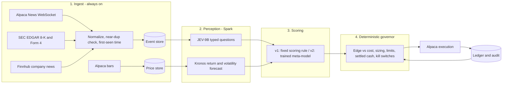

# 02 — Design Spec: Architecture, Build Order, Evaluation

**Status:** v2 (incorporates review of v1)
**Date:** 2026-10-04
**Depends on:** `01-research-spec.md` (evidence base, metrics, gates G1–G5)
**Principles:**
1. Don't invent anything. Assemble proven open components (an open JEV replica, Kronos, Alpaca).
2. Build a **working end-to-end prototype first (v1, zero-shot, no training)**, then upgrade one component at a time. Each upgrade must beat the previous version on the same frozen evaluation.
3. Spend the effort on **data correctness, evaluation, and risk control**, because that is where trading systems fail.

---

## 0. Decisions locked

| # | Decision |
|---|---|
| D1 | **Universe:** US stocks first. Crypto (BTC/ETH/SOL) is a later sleeve on the same pipeline. No prediction markets. |
| D2 | **Idle capital:** cash. "Idle cash in SPY" is reported as a synthetic backtest variant only (avoids Good Faith Violations in a cash account). |
| D3 | **Account:** $500 cash, long-only. The $2k margin account is unlocked only after G5. |
| D4 | **Brev:** $200 total. Everything else runs on **one DGX Spark**. |
| D5 | **News:** Alpaca News (Benzinga), SEC EDGAR, Finnhub. No GDELT. |
| D6 | **System-1:** **autotrust/JEV-9B** (Qwen3.5-9B backbone, distilled from Jev 1.13, Apache-2.0 corpus). Used zero-shot in v1. |
| D7 | **Price model:** **Kronos** (small/base, MIT). Zero-shot in v1. Pretraining data ends **June 2024**, per the Kronos paper (arXiv 2508.02739). |
| D8 | Gates G1–G5 from 01 §5.5. |
| D9 | **Build order:** v1 = full pipeline with off-the-shelf models and **no fine-tuning**, through backtest and paper trading. Training comes after (§7). |

---

## 1. System overview



**Cadence:** ingestion runs continuously and records each item's first-seen time. Decisions happen at **two cycles per session**: **09:45 ET** (close of the first 15-minute bar) and **30 minutes before the close** (15:30, or 12:30 on half days). The edge being targeted is multi-day drift, so faster cycles add cost without adding edge. These cycle times are defined in one place (`src/ws/calendar.py`), and labels, backtests, and the live scheduler all import them.

---

## 2. Data layer (M1, built)

### 2.1 Sources (what the code expects; **verified by `scripts/probe_apis.py`**)
| Source | Used for | Point-in-time timestamp |
|---|---|---|
| Alpaca News REST (2015→) + WebSocket | Main news | Backfill: vendor `created_at`. Live: **our receipt time** |
| SEC EDGAR submissions JSON | 8-K items, Form 4 | `acceptanceDateTime` (**timezone to be verified**, see below) |
| Finnhub `/company-news` (~1 year) | Second source, coverage check | `datetime` (epoch) |
| Alpaca bars: 1Day **unadjusted** | Point-in-time universe filter (price, dollar volume) | bar time |
| Alpaca bars: 15Min **split/dividend-adjusted** | Entry/exit prices for labels and backtests | bar start time |

**Nothing in the API layer is trusted until the probe has run against the live APIs.** This container's network policy blocks all of these hosts, so the probe has not been run yet; it is the first task on the Spark. The probe checks:
- **Alpaca news:** every field the normalizer reads is populated; ascending sort holds across pages; pagination works; how often articles are *revised* after publication (`updated_at > created_at`, a leak risk, because history returns the revised text); articles per day for each year since 2015.
- **Alpaca WebSocket** (`--ws-seconds`): the delay between vendor `created_at` and our receipt. **This sets the latency the backtest adds** to historical items, so they are never acted on sooner than live ones would be.
- **Bars:** whether intraday bars include pre/after-hours (labels drop them either way); that `t` is the bar *start*; split adjustment (NVDA 10:1, June 2024, raw vs. adjusted); **whether delisted tickers (SIVB, FRC) still have history**, i.e. whether the dataset is free of survivorship bias; whether the free plan serves SIP or only IEX history.
- **EDGAR:** compares `acceptanceDateTime` in the JSON with the `ACCEPTANCE-DATETIME` filing header (stated in Eastern time) for 5 filings, to establish whether the JSON's "Z" suffix really means UTC. A 4–5 hour error here would leak after-close filings into the same-day decision.
- **Finnhub:** fields, vendors, and how far back the free history actually goes.
- **Duplicate study:** same ticker, within 48 h, cross-source pairs. Prints the Jaccard similarity distribution plus example pairs in each band so a human picks the threshold.

Measured values go in `configs/sources.yaml`. Code that depends on them **refuses to run while they read `UNVERIFIED`**. Downloading raw payloads is always allowed, because the raw archive is immutable and normalization can be re-run.

### 2.2 Normalization, storage, duplicates
- **Event record:** `{event_id, source, source_id, first_seen_ts, ts_origin (observed|vendor), published_ts, updated_ts, ingested_at, tickers[], headline, body, url, kind, meta}`. Timestamps must be timezone-aware UTC. A record with `first_seen_ts > ingested_at` is rejected.
- **Storage:** raw payloads are archived immutably (`data/raw/…jsonl.gz`). Normalized events go to append-only Parquet, read through DuckDB. **First write wins**, so a vendor's later revision cannot overwrite what was originally stored.
- **Near-duplicates** (syndicated copies of one article): MinHash LSH finds candidates, which are then **confirmed by exact Jaccard**, a shared ticker, and the time window. The earliest copy becomes the canonical one. The threshold comes from the probe, not a guess.
- **Different articles about the same story are deliberately *not* merged by text similarity.** That problem is solved by the evaluation unit (§3).

### 2.3 Point-in-time universe
Instead of hindsight S&P 500 membership: a ticker is eligible on session *t* if its **previous** close is ≥ $5 and its 20-session median dollar volume (computed through *t−1*) is ≥ $20M, using **unadjusted** daily bars. Adjusted history would wrongly fail old NVDA-type prices. This is survivorship-free if delisted names have bars (a probe check).

---

## 3. Evaluation design (the part that has to be right)

### 3.1 Evaluation unit: (ticker, decision cycle)
Every event mentioning a ticker that becomes actionable before the same cycle is folded into **one sample**. Five syndicated copies, or ten follow-up stories, still count as one observation, so they can't inflate t-statistics. In v1 the model scores each item and the sample's signal is aggregated across items, using the strongest material item.

### 3.2 Labels (implemented and tested in `src/ws/labels.py`)
- **Actionable cycle** = the first cycle ≥ `first_seen_ts + latency` (latency comes from the probe).
- **Entry price** = close of the last regular-hours 15-minute bar ending at or before the cycle. This is the price the bot could actually have traded near.
- **Exit** = the afternoon cycle *h* sessions later (h = 1, 5, 10). That is exactly when the governor's time-exit would sell.
- **Abnormal return** = raw return − β × SPY return over the **identical interval**. β is a trailing 252-session daily beta using **only sessions before** entry.
- **Tests prove:** wrecking every price after the exit leaves labels unchanged; wrecking prices after the cycle leaves the entry unchanged; extended-hours prices are never used; half days and holidays are handled; a session's own prices never enter its beta. All 28 tests pass.

### 3.3 Which models are evaluated? The same ones we trade with
Yes, it matters, and **v1 evaluates only the production models**. The PIT-4B "history track" idea from v1 of this spec is dropped from the v1 plan. It tested the *recipe* with a stand-in model, not the model we'd actually trade, so it could only ever be indirect evidence.

The catch: a model can only be trusted on data **after everything it was trained on**.

| Model | Trained-on data ends | Clean evaluation window | Length |
|---|---|---|---|
| Kronos | June 2024 (paper) | 2024-07 → now | ~27 months |
| JEV-9B | Qwen3.5 base released Feb 2026; Jev distillation corpus date unknown | **To be measured**, expected ~2026-03 → now | ~7 months |

So v1 has two backtests:
1. **Full system** (JEV-9B + Kronos + governor) on the JEV-9B clean window.
2. **Kronos-only** baseline on its longer window.

The JEV-9B horizon is not taken on faith. A **memorization probe** asks the model about known past price moves and earnings outcomes month by month. The month where accuracy drops to chance is the empirical cutoff, and the backtest starts after it (with a 1-month buffer).

**Is ~7 months enough?** At the *event* level, probably. Thousands of (ticker, cycle) samples give usable IC and abnormal-return t-stats. At the *portfolio* level, no. That's why paper trading (G4) continues accumulating evidence, and why the window grows every month the system runs.

### 3.4 Metrics, baselines, gates
These are as defined in 01 §5 (IC, abnormal returns by score decile, Brier/ECE, Sharpe/IR vs. SPY, alpha, Deflated Sharpe Ratio, Probability of Backtest Overfitting), with the **random-entry control** as the key baseline. Every configuration tried is logged, because the Deflated Sharpe Ratio needs the true number of trials. The most recent 2 months of the clean window are a **frozen holdout**, touched once per version.

---

## 4. v1 prototype: zero-shot, end to end

| Stage | v1 implementation (no training) |
|---|---|
| Perception | JEV-9B zero-shot typed questions per event: `material` (yes/no), `event_type` (choice), `direction` (score: 5 levels), `surprise` (score: 4 levels) |
| Price | Kronos-small zero-shot on the last 400 daily bars: 32 sampled paths → P(up over 5 sessions), forecast volatility |
| Scoring | **Fixed rule:** `signal = material × (2·direction − 1) × surprise`. Long candidates need signal ≥ θ and Kronos P(up) ≥ 0.5. θ is set on the first half of the clean window only |
| Governor | As in §5. Deterministic and unit-tested |
| Execution | Alpaca **paper** account, same code path as live |

v1 is done when it runs unattended on the Spark for 2 weeks of paper trading **and** produces a full G1/G2 tearsheet on the clean window. It does not have to be profitable. It is the baseline every upgrade must beat.

---

## 5. Deterministic governor
| Rule | v1 value |
|---|---|
| Entry filter | Signal ≥ θ; Kronos P(up) ≥ 0.5; spread ≤ 10 bps; ticker eligible (§2.3) |
| Sizing | Equal weight in v1: min(20% equity, settled cash / open slots). Kelly sizing waits until probabilities are calibrated (v2) |
| Caps | ≤ 5 positions, ≤ 2 per sector, long-only, gross ≤ 100% |
| Settled cash only | Buy only with settled cash. Good Faith Violations are impossible by construction |
| Orders | Marketable limit at mid + ½ spread, cancelled after 5 min. Idempotent `client_order_id` |
| Stop | 2 × ATR(14) stop. Fractional stops are DAY-only, so they are re-submitted at 09:31 each session |
| Exit | Afternoon cycle at horizon h = 5, or the stop |
| Kill switches | Day P&L ≤ −4%; drawdown ≤ −15%; data stale > 15 min; broker/ledger mismatch → flatten and halt |

---

## 6. Milestones (revised: end to end first)

| M | Deliverable | Exit criterion |
|---|---|---|
| **M0** ✅ | Repo, config, CI (ruff, mypy, pytest), Dockerfile | CI green |
| **M1** 🟡 | Ingestion, raw archive, event store, near-dup detection, labels, PIT universe, **API probe**, backfill, data-quality report | **Code built and tested. Pending:** probe run + backfill on the Spark, then `dq_report.py` PASS (zero timestamp violations; ≥ 95% of eligible ticker-months have news) |
| **M2** | Model serving on the Spark (vLLM + JEV-9B, Kronos), memorization probe → measured JEV-9B clean window | Clean window fixed in config |
| **M3** | **v1 end to end**: scoring rule, governor, backtester (same governor code), random-entry and SPY baselines, tearsheet | G1/G2 report produced on the clean window (pass or fail, both are information) |
| **M4** | v1 on Alpaca paper, unattended, with dashboard and alerts | 2 weeks unattended; then G4 accumulation begins |
| **M5+** | Upgrades, **one at a time**, each vs. the frozen v1 eval (§7) | Beats previous version on the holdout and Deflated Sharpe |
| **M6** | Live $100–250, then $500 | G5 |

---

## 7. After v1: fine-tuning and RL

### 7.1 Where training data comes from
The market labels it for us; no human annotation is needed. Every (ticker, cycle) sample from §3 pairs **text** (all events for that ticker before the cycle) with **outcomes** (abnormal returns at 1/5/10 sessions). Alpaca News since 2015 yields hundreds of thousands of samples, and FNSPID adds 15.7M older articles for pretraining-style use.

The catch is the same as in §3.3. **Training samples must come from before the evaluation window, and evaluation must stay inside the model's clean window.** Fine-tuning on 2016–2025 and evaluating on 2026 is fine. The base model's own memory is the only leak, and the memorization probe bounds it.

### 7.2 How easy each upgrade is (ordered by cost)
| Upgrade | Difficulty | Where |
|---|---|---|
| U1: Trained meta-model (LightGBM) on JEV answers + Kronos features → calibrated P(win) | Easy, minutes | Spark CPU |
| U2: Decision heads on frozen JEV-9B hidden states, predicting return buckets | Easy (logistic/MLP on cached features) | Spark |
| U3: Kronos fine-tune on US bars | Easy (repo ships `finetune_csv` scripts; 25–100M params) | Spark |
| U4: LoRA fine-tune of JEV-9B on return buckets (same recipe it was built with: LoRA r=16 + head) | Moderate | Spark (~50k tok/s LoRA on 8B) |
| U5: GRPO (RL) on the reasoner | Harder; optional | Brev (~$100) |

### 7.3 What the reward function is
- **For the decision model (U2/U4, and GRPO if used):** a **proper scoring rule** on the realized outcome. Let y = 1 if `abret_5 > cost hurdle`, otherwise 0. The model's probability p is rewarded with **r = −(p − y)²** (Brier) or **log p / log(1 − p)**. This directly rewards *calibrated* probabilities, the same goal as Jev's RLCD. Supervised cross-entropy optimizes it too, which is why U2/U4 come before any RL.
- **For a trading policy (only if ever needed):** r = position × abnormal return − transaction costs − λ × drawdown penalty. This is far noisier, which is why the governor stays a fixed rule.

### 7.4 Is there an RL gym for stock trading?
Yes: **FinRL / FinRL-Meta** (Gymnasium stock-trading environments), **gym-anytrading**, **TradeMaster**, and **Qlib**'s RL module (order execution). But **we don't need one.** Our problem is a one-step *contextual bandit*: read the news → decide → reward arrives h days later, with no sequence of dependent actions to learn. Training is therefore just batches of (text, label) pairs fed to TRL's `GRPOTrainer` (or plain supervised fine-tuning) with the reward above. A multi-step gym only becomes relevant if we ever learn *position management*, and the plan explicitly avoids that.

---

## 8. Repository layout (current)
```
configs/sources.yaml      probe-verified source assumptions (UNVERIFIED until measured)
docs/                     01 research, 02 design, probe + data-quality reports (generated)
scripts/probe_apis.py     validate every API assumption against live endpoints
scripts/backfill.py       news | daily-bars | intraday-bars | edgar | finnhub | normalize (resumable)
scripts/dq_report.py      M1 exit gate
src/ws/calendar.py        NYSE sessions + decision cycles (single source of truth)
src/ws/labels.py          (ticker, cycle) samples, entry/exit prices, abnormal returns, trailing beta
src/ws/universe.py        point-in-time eligibility
src/ws/ingest/            alpaca_news, edgar, finnhub, bars, rate-limited HTTP client
src/ws/store/             raw archive, append-only event/bar stores, near-dup detection
tests/                    28 tests: calendar, normalizers, store, dedupe, labels (leakage), HTTP
```

## 9. Open items
1. **Run the probe** on the Spark (needs keys; §2.1), fill `configs/sources.yaml`, run the backfill and DQ report.
2. **Measure JEV-9B's clean window** (M2). If it is much shorter than ~6 months, extend evaluation by running paper trading longer before G3/G4 decisions.
3. **Ticker renames** (e.g. FB→META): Alpaca news symbols vs. bar symbols. Coverage in the DQ report will show the size of the problem.
4. The Dockerfile is written but **unbuilt** (no Docker daemon in the build environment). Build it on the Spark.

## Sources
- JEV-9B — https://huggingface.co/autotrust/JEV-9B ; OpenJev — https://github.com/razorback16/openjev ; Von — https://github.com/wfzyx/von
- Kronos — https://github.com/shiyu-coder/Kronos ; paper (pretraining ends June 2024) — https://arxiv.org/abs/2508.02739
- Qwen3.5 release timing — https://www.datalearner.com/en/ai-models/pretrained-models/qwen3-5-max-preview
- Alpaca free plan SIP history (15-minute delay) — https://forum.alpaca.markets/t/free-subscription-does-not-provide-data-for-last-15-mins/6485
- Trading-R1 (SFT → GRPO) — https://arxiv.org/abs/2509.11420
- FNSPID — https://github.com/Zdong104/FNSPID_Financial_News_Dataset
- Look-Ahead-Bench (memorization / alpha-decay test) — https://arxiv.org/abs/2601.13770
