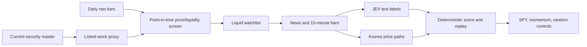
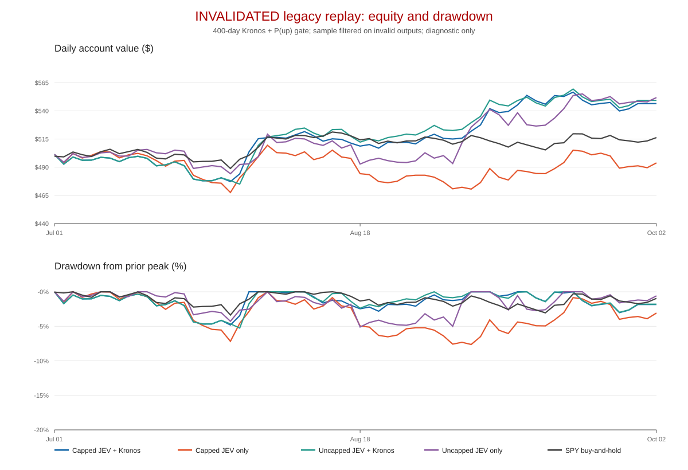
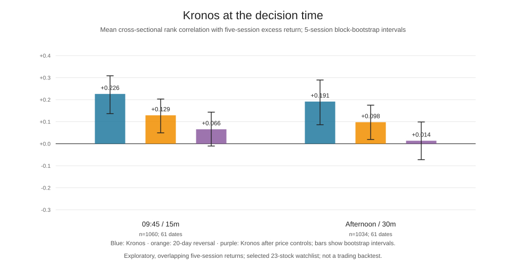

# Broad market scan and model experiment

**Status:** exploratory research only. No Reddit data, paid data access, broker orders, or model fine-tuning.

## What the models do

The pipeline does not use a general-purpose “world model.” It uses two separate models with narrow jobs:

- **JEV-9B** reads a news item about a target ticker and returns fixed decisions: investor sentiment, whether the item is material, and how surprising it is. The current signal is a deterministic combination of those labels. It is a text classifier, not a price forecaster. Its model card exposes a text-classification pipeline and a separate decision head.
- **Kronos-small** reads recent OHLCV bars and samples possible future price paths. We summarize those paths as an up probability and forecast dispersion. It does not read news or explain events. Kronos tokenizes financial K-lines and autoregressively predicts their next tokens.
- A deterministic replay/risk layer combines the model outputs with price eligibility, position caps, holding rules, and costs. Neither model sends orders.

## Why screen broadly, then focus

The earlier eight tickers were an integration sample, not a market-wide limit. The account exposes about 14,400 active and 19,000 inactive U.S. listings. We retain a heuristic listed-stock proxy, then calculate price and dollar-volume eligibility from prior sessions. A scan of roughly 6,500 symbols yielded about 1,900 eligible names on the latest full session. The current watchlist ranks the most liquid 25; two names lack 400 pre-test daily bars and are excluded from the model replay, leaving 23.

That is close to how a practical day-trading workflow is organized: scan a broad market for movers, volume, price and other conditions, then focus attention on a smaller changing list. Interactive Brokers’ official scanner documentation describes scans for top gainers, most active, hot by price/volume, and user-defined filters, with dynamic lists of qualifying symbols. The watchlist should eventually add same-day gap, relative volume, catalyst, halt and spread checks. A 20–25 name research watchlist is not a claim that traders only follow 20 names.

The broad price screen is daily. JEV and Kronos only run after screening, where news and intraday bars justify the compute. Downloading 1-minute bars or classifying every news item for every listed ticker would add cost and noise without improving this first research test.

## Data cached

- An Alpaca active/inactive asset snapshot and a reproducible stock-proxy selection file.
- Three years of raw daily bars for point-in-time eligibility and three years of split/dividend-adjusted daily bars for return comparisons: 3,885,774 rows in each store, from 2023-10-04 through 2026-10-02, across 5,807 tickers with available history.
- The price screen uses prior close at least $5 and prior 20-session median dollar volume at least $20 million. It yields 1,932 eligible stock-proxy symbols on 2026-10-02.
- The 25-name liquid watchlist has three months of Alpaca news and 15-minute SIP bars cached. The current asset API does not provide a definitive security-type field, so ETF/fund exclusions use exchange, ticker syntax and names; residual misclassification is possible.
- GME has 665 Alpaca news articles from 2021-01-01 through 2021-02-15, 21,547 one-minute bars through 2021-02-12, and matching daily bars. Of those articles, 305 had a later vendor revision; those are made available only at the revision timestamp.
- The broad cache has 8,225 normalized Alpaca articles, no duplicate IDs, no acausal timestamps, no early use of revised text, and no normalization rejects. The declared 23-stock/four-month window covers 92 eligible ticker-months with 100% news ticker-month coverage. The audit remains EXPLORATORY because news latency and approximate-deduplication thresholds are unverified.

The current Alpaca security master is not historical membership. Daily bars exist for 5,549 of the 6,537 proxy symbols; inactive symbols help recover some delisted history, but this sample is not certified survivorship-free. SIVB, FRC and BBBY are absent from the current master and the bar cache. The 2023-10 daily range gives the fixed 12–1 momentum control a one-year warm-up before the evaluation begins.

## Results so far

The price-only comparison covers 24 monthly windows, 2024-11-01 to 2026-10-02. Equal-weight top-20 12–1 momentum returned 69.4% gross and 57.7% after subtracting 15 basis points per side at each monthly rebalance. SPY buy-and-hold returned 37.8% with an 18.8% daily maximum drawdown. The momentum portfolio had a 34.0% monthly maximum drawdown gross (34.9% after modeled costs). Equal-weighting eligible names with sufficient 12–1 history returned 33.7%. Across 100 random top-20 controls, the median was 29.0%, the range was -4.1% to 76.5%, and 33 controls beat SPY. This is one short exploratory period; some random portfolios beat the selected momentum rule, and the asset master leaves survivorship risk.

JEV scored 665 GME-tickered articles. A timestamp-safe one-minute entry was possible for 661. The retrospective GME JEV signal had Spearman correlation 0.085 with same-day close returns and 0.084 with five-session close returns. GME buy-and-hold from the 2021-01-22 close to the 2021-02-04 close returned -17.7%, versus +0.9% for SPY. The best intraday high was 643% above the Jan 22 close, but that hindsight peak does not supply a real-time exit rule. These figures do not validate JEV: it postdates the GME squeeze, may have memorized it, there are no human labels for the articles, and the daily observations are highly dependent. See `gme-2021-report.md` for full caveats.

JEV’s existing public text benchmarks are PhraseBank accuracy 0.882 / macro-F1 0.877 and FiQA accuracy 0.876 / macro-F1 0.761. Public-set training overlap is unknown, and text-label accuracy is not trading profitability.

The completed zero-shot event replay uses 2,433 scored ticker-cycle samples across the 23-name watchlist from 2026-07-01 through 2026-10-02. After requiring exact entry/exit/reference bars, 15-session ATR warm-up, and a valid Kronos forecast, 1,773 samples remain. It excludes 187 samples for missing exact intraday bars, 445 for ATR warm-up, and 28 ticker-cycle samples affected by invalid Kronos forecasts. Those exclusions are reported explicitly; they are not filled or imputed.

**Invalidated replay figures:** the portfolio replay below still uses the legacy 400-day Kronos forecast and `P(up) >= 0.5` gate, whose extreme negative bias and invalid paths were diagnosed later. It excludes exactly 28 ticker-cycle samples with invalid forecasts, so even JEV-only and random controls inherit sample selection based on the broken Kronos run. The new decision-time Kronos features have not been sent through this strategy/replay. Do not interpret any return, drawdown, cost sensitivity, or random-control comparison in the legacy replay reports as evidence; the values are retained only for reproducibility. The SPY buy-and-hold figure is a standalone period baseline, not a comparison that validates those strategies.

The earlier sector-cap bug was also corrected: the initial run used a sector table for the eight-ticker smoke test, causing the other 15 names to share one `unknown` sector bucket and compete for two slots. The full-watchlist sector mapping fixes that implementation bug, but it does not repair the legacy Kronos filter described above.

| Five-session strategy | Corrected, 2 per sector | No sector cap |
|---|---:|---:|
| JEV + Kronos | +9.29% | +9.87% |
| JEV text only | -1.24% | +10.36% |
| Kronos only | +13.39% | +1.17% |
| 12–1 momentum | +9.51% | -13.81% |
| SPY buy-and-hold | +3.26% | +3.26% |
| Random-entry median (30 seeds) | +4.31% | +5.31% |

Those portfolio values are invalidated for the sample-selection and forecast reasons above. Separately, the direct JEV signal rank correlation with five-session market-adjusted return is -0.062; it does not support the claim that JEV identified future winners.

The same-day 09:45 ET toy basket also used the legacy Kronos sample filter and is invalidated for strategy comparison. See [the invalidated sector-capped replay](broad-replay-report.md) and [the invalidated uncapped sensitivity](broad-replay-no-sector-cap-report.md) for the recorded diagnostic outputs.

## Kronos at the actual news decision time

I replayed morning 09:45 ET decisions using completed 15-minute bars and afternoon decisions using completed 30-minute bars. Rank IC is invariant to subtracting the same SPY return from every stock on a date; these are cross-sectional stock-return ranks, not evidence of beating SPY. Market adjustment remains relevant for absolute forecast/return values and thresholds. On raw ranks Kronos is ahead of 20-day reversal in both cycles, but this advantage mostly disappears after residualizing within each date against reversal, distance from the 400-day average, the current-day move versus SPY, and the opening gap. `current_day_return` and `current_day_vs_spy` therefore have identical per-date rank-IC summaries by construction.

| Decision cycle | Valid ticker-cycle samples | Raw Kronos mean rank IC (95% block CI) | 20-day reversal | Kronos after price controls |
|---|---:|---:|---:|---:|
| 09:45, 15-minute bars | 1,060 / 61 dates | +0.226 [+0.137, +0.308] | +0.129 [+0.050, +0.203] | +0.066 [-0.010, +0.143] |
| Afternoon, 30-minute bars | 1,034 / 61 dates | +0.191 [+0.086, +0.289] | +0.098 [+0.019, +0.175] | +0.014 [-0.072, +0.099] |

This is the closest test so far to the intended decision-time use. It covers only the selected 23-name watchlist and news-candidate cycles, has overlapping five-session outcomes, and uses a 5-session block bootstrap. Raw feature/settings exploration makes the same 2026 period exploratory, not an untouched holdout. The morning residual is small and its interval crosses zero; the afternoon residual is near zero. For volatility, ATR(14) ranks realized volatility better than Kronos path dispersion in both cycles (0.700 vs. 0.521 in the morning; 0.693 vs. 0.565 in the afternoon).

The inference runner marked 16 invalid dates in the old 32-path, 400-day run rather than aborting; they affected 28 ticker-cycle samples (INTC 5, MU 5, STX 3, AMD 2, WDC 1). The separate 10-path daily 400-day sweep produced 10 invalid jobs. An invalid job means at least one sampled path yielded a non-finite or non-positive close, so the job was rejected. The reason is not conclusively diagnosed. The legacy replay's 28 exclusions are the specific flaw that invalidates its strategy figures.

Kronos has a usable model-clean period according to its paper: its pretraining data ends June 2024, and the paper starts its evaluation in July 2024. Thus July 2024–June 2026 is out of sample with respect to the stated pretraining cutoff ([paper, forecasting setup](https://arxiv.org/html/2508.02739#S5)). It is not automatically a pristine project holdout: price-only universe and strategy research has already examined overlapping dates. Keep this distinction explicit in the next protocol.

## Training plan

The current run is zero-shot; no weights are being trained. The next model should be a small, auditable **meta-model**, trained only after the broad replay is complete. Its inputs can include cached JEV label probabilities/signals, Kronos forecast summaries, price momentum, gap, relative volume, liquidity and market regime. Its target should be a timestamp-safe future market-adjusted return or return bucket at predefined horizons.

Use rolling chronological train/validation/test windows, purge overlapping outcomes with an embargo at least as long as the target horizon, and freeze the most recent window. Compare the meta-model against SPY buy-and-hold, equal-weight eligible stocks, fixed momentum and random-entry controls, with realistic costs. Only consider fine-tuning JEV after collecting enough manually checked, time-stamped sentiment/materiality labels and proving incremental value over its frozen outputs. Kronos's official repository does include a custom-CSV fine-tuning pipeline ([guide](https://github.com/shiyu-coder/Kronos/tree/master/finetune_csv), [training script](https://github.com/shiyu-coder/Kronos/blob/master/finetune_csv/train_sequential.py)). First test the frozen model on the model-clean period using a point-in-time universe. The current 23-name universe was selected using 2026 liquidity and is not valid for 2024–2026. The existing broad daily cache can support a historical liquidity-based universe; 15/30-minute bars must be backfilled for that time-varying symbol set. Then reserve a later chronological block as the untouched project holdout. Only fine-tune after zero-shot value survives those tests.

## References

- [JEV-9B model card](https://huggingface.co/autotrust/JEV-9B)
- [Kronos paper](https://arxiv.org/abs/2508.02739) and [official implementation](https://github.com/shiyu-coder/Kronos)
- [Interactive Brokers market scanners](https://investors.interactivebrokers.com/en/index.php?f=1394)
